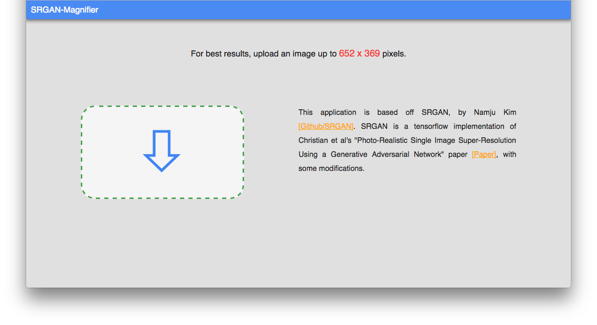
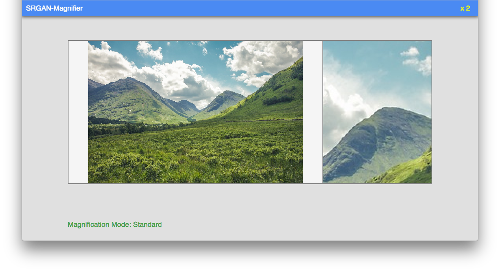
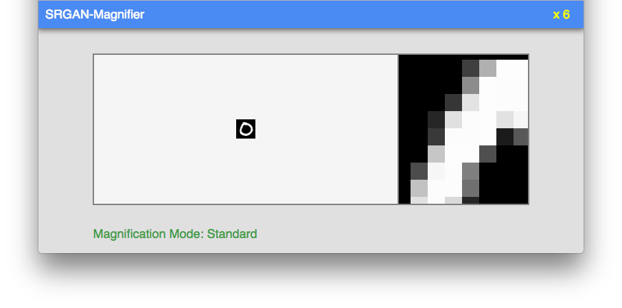
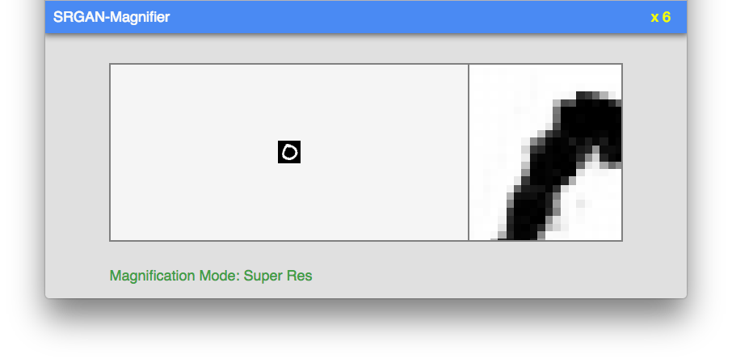

# SRGAN-Magnifier
UIC, Spring 2017

CS 523: Multimedia Systems

http://creativecoding.evl.uic.edu/courses/cs523/
## Assignment 1 & 2
A1 - Peter

https://www.youtube.com/watch?v=jkMaJcheuAQ&feature=youtu.be

https://www.youtube.com/watch?v=UFBBRPlKbzk&feature=youtu.be

A2 - Peter

http://www.creativeai.net/posts/7ntWrv2a8ZL59hJoK/logojoy-ai-powered-logo-creator-as-service
## Intro
This application is based off SRGAN, by Namju Kim (https://github.com/buriburisuri/SRGAN).

SRGAN is a tensorflow implementation of Christian et al's "Photo-Realistic Single Image Super-Resolution Using a Generative Adversarial Network" paper (https://arxiv.org/abs/1609.04802), with some modifications.

Summary of paper: [Slides](resources/paper_Summary_Slides.pdf) (also located in the resources folder)
## Write-up
see resources folder


## Basic Usage
To start the server:
```bash
node server.js
```

To start the application, go to a web browser and type:
```bash
http://localhost:4200/
```

## Demo









SRGAN-Magnifier (mnist sample)

https://youtu.be/bBNx8gSLBX0

SRGAN-Magnifier (mountain sample)

https://youtu.be/_Oi-w44yJa0

